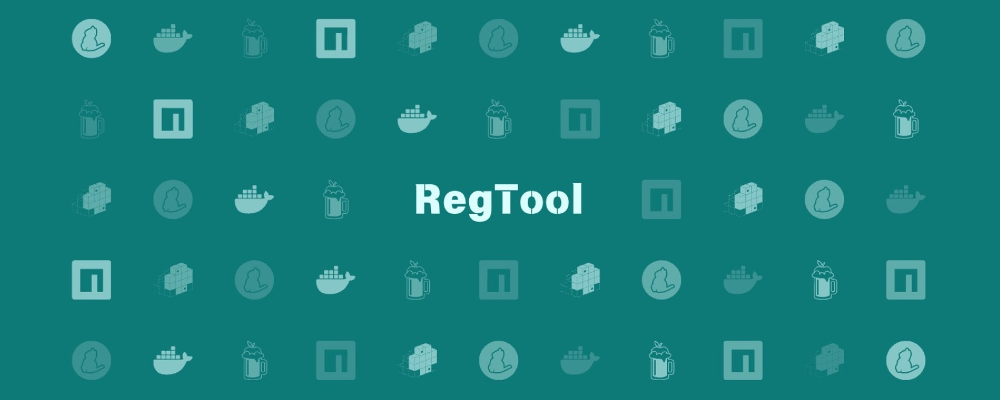

### Supported Software

**RegTool** supports a wide range of software registries and package managers to enhance your development workflow. Below is a comprehensive list of the software currently supported:

**Features:**

- **Using TUI instead CLI**: The TUI provides a more intuitive user experience.
- **Multi-Registry Management**: Easily switch between different registries for each supported software.
- **Secure Token Storage**: Securely manage and store access tokens for private registries.
- **Centralized Configuration**: Simplify and centralize the configuration of all supported package managers and registries.
- **User-Friendly Interface**: Navigate through settings and configurations with an intuitive interface.

**How to Use:**

1. **Installation**: Follow the installation instructions specific to your operating system.
2. **Configuration**: Use the provided interface or command-line tools to configure your registries.
3. **Management**: Easily switch between registries and manage access tokens as needed.

By supporting a wide range of software and registries, RegTool aims to streamline your development process and provide a seamless experience across different ecosystems.

### Supported Software Table

| Name       | Description                                                                              | Availability                                                        |
| ---------- | ---------------------------------------------------------------------------------------- | ------------------------------------------------------------------- |
| npm        | Manage Node.js packages and switch between public and private npm registries seamlessly. |  |
| Yarn       | Configure Yarn package manager registries, supporting both public and private packages.  |          |
| Docker     | Handle Docker image registries, including Docker Hub and private Docker registries.      |          |
| Homebrew   | Manage Homebrew taps and repositories for macOS and Linux package installations.         |          |
| pip        | Configure and manage Python package indexes, including PyPI and private repositories.    |          |
| RubyGems   | Manage Ruby gems and configure sources for gem installations.                            |          |
| Maven      | Handle Java dependencies and configure Maven repositories.                               |          |
| Gradle     | Manage Gradle repositories for Java projects.                                            |          |
| Composer   | Handle PHP package management with Composer and configure repositories.                  |          |
| NuGet      | Manage .NET packages and configure NuGet repositories.                                   |          |
| Cargo      | Handle Rust packages and configure Cargo registries.                                     |          |
| Go Modules | Manage Go packages and configure module proxies.                                         |          |
| Helm       | Configure Helm chart repositories for Kubernetes applications.                           |          |
| Conan      | Manage C/C++ packages and configure Conan repositories.                                  |          |
| Pub        | Handle Dart packages and configure Pub repositories.                                     |          |

RegTool aims to streamline your development process and provide a seamless experience across different ecosystems.
